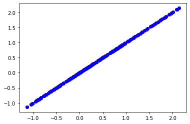
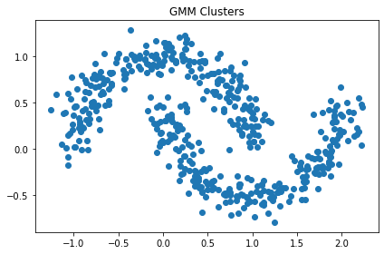
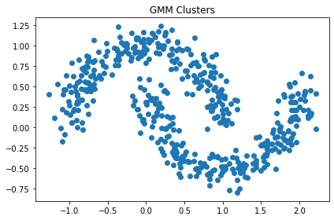
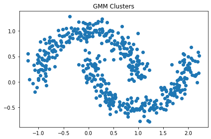

# Gaussian_Mixture_Models
Implementation of different Gaussian Mixture Models, both from scratch, and by using  GaussianMixture model in scikit-learn.

<h2> &nbsp;Part A:</h2>

Implementation of a **Gaussian Mixture Model from scratch**, to estimate the distribution of the **Noisy Moons** dataset, by using **AIC** and **BIC** metrics to find the optimal number of components.

I import the **noisy moons** dataset and preprocess the data to put it into **pandas dataframe**:

```ruby
noisy_moons = datasets.make_moons(n_samples=500, noise=0.11)
```

Then, I preprocess the data and split it to train and test sets to implement a **Gaussian model**.

<h4> &nbsp;The mean_cov_calc function:</h4>

I caculate **mean** and **covariance** for each distribution, using the following function:

```ruby
def mean_cov_calc(class_i)
```

The results are as below:

mean of class 0: [0.04687731 0.63012771]

cov of class 0: [[0.5026161341974046, -0.014980329455481625], [-0.014980329455481625, 0.10505516646917418]]

mean of class 1: [ 0.98696738 -0.14261332]

cov of class 1: [[0.5221430428454983, -0.003104636497334427], [-0.003104636497334427, 0.10291468316384425]]

<h4> &nbsp;The Gx_calc and decision_make functions:</h4>

I implement my **prediction function** using the above algorithm to calculate the weights:

```ruby
def Gx_calc (test_sample, train_set, class_i)
def decision_make (test_sample, train_set, class_0, class_1)
```

By plotting points of each class it is seen that the results are not much acceptable.



So the second step is implementing a GMM model.

First, I define the GMM class (by using multivariate_normal) in which I define the functions for **E step** and **M step**, and finally fit the data. Then, I define a **jitter function** to plot the new points.

```ruby
from scipy.stats import multivariate_normal
def jitter(x)
```

The results for num of components equal to 3,8,16:

<h2> &nbsp;n = 3:</h2>



<h2> &nbsp;n = 8:</h2>



<h2> &nbsp;n = 16:</h2>



Finally I implement **AIC** and **BIC** graphs for the best num of components. We know that the best num of components is the one with the **lowest** AIC and BIC scores which as we see is 6.

```ruby
gmm.fit(X).aic(X)
gmm.fit(X).bic(X)
```

<h2> &nbsp;Part B:</h2>

Implementation of a **Gaussian Mixture Model** as a generative model on **MNIST** dataset by using AIC graph for finding the optimal number of model components.

First, I read the test and train data, and **standarize** the data to minimize the computations by using **MinMaxScaler**. Then, 
I check the model for different number of components by using the **GaussianMixture** library.

I plot the **AIC graph** for each model, knowing that the best model is the one with the lowest AIC score.

By choosing the num of components equal to 60 as below, I got 100 samples from the model, and tested the **convergence** on the model:

```ruby
gm = GaussianMixture(n_components=60, random_state=0).fit(data)
```

In the final step, I apply **PCA** to the model. I implement the gausssian mixture model on the reduced data, and by getting 100 samples from the model I check the convergance.

Comparing the results before and after implementing pca: In the pca method by reducing the dimensions, we **simplify** the calculations and the algorithm becomes much **faster**, still with a **good accuracy** so it is a good choice for GMM models.
